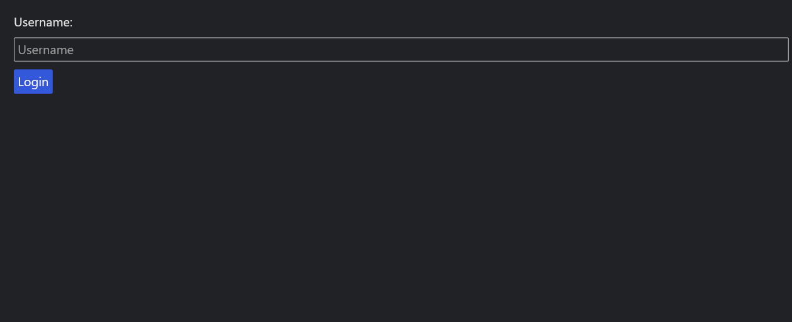
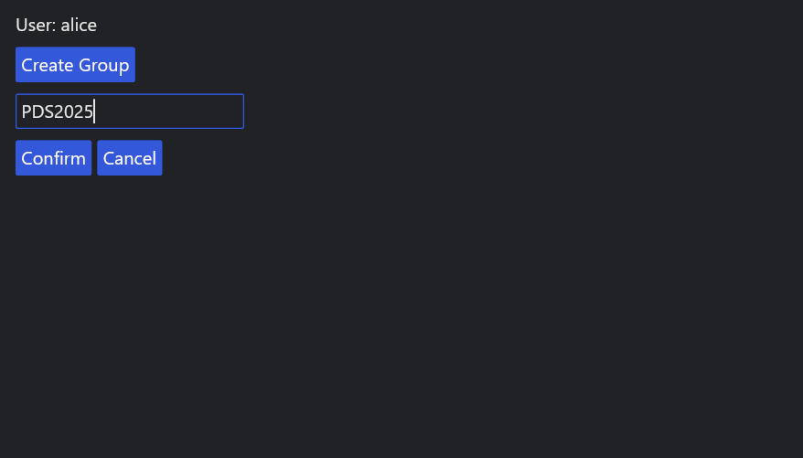
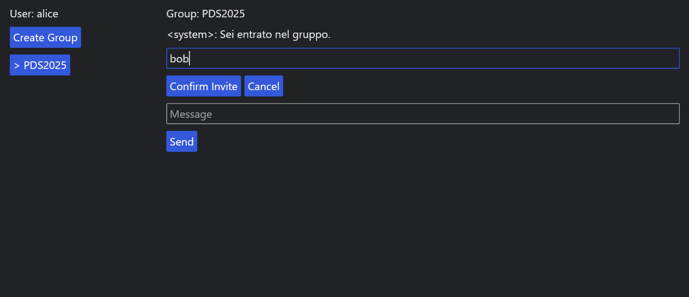
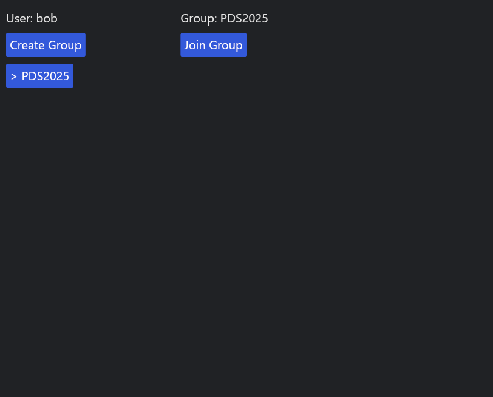
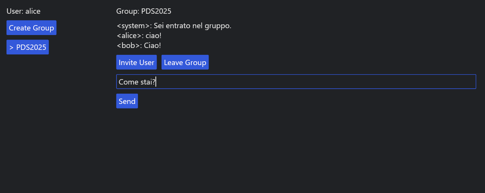
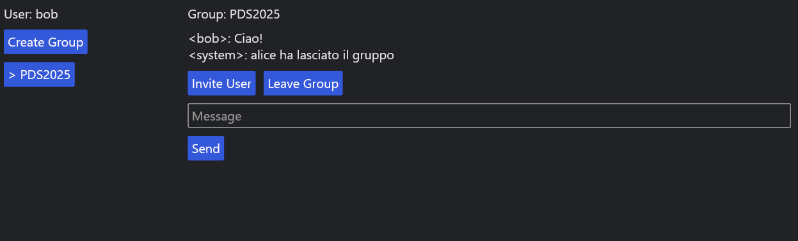

# 📘 Manuale Utente — Applicazione "Ruggine"

---

## 📦 Struttura del progetto

All'interno della cartella `release` troverai:

```
release/
├── Windows/
│   ├── cpu.log
│   ├── server.exe
│   └── gui_client.exe
├── macOS/
│   ├── cpu.log
│   ├── server
│   └── gui_client
└── documents/
    ├── MANUALE_UTENTE.md
    ├── tests_and_benchmark.md
    └── images/ (opzionale)
```

---

## 🔧 Prerequisiti

✅ Non è necessario avere installato Rust sul computer target.  
I binari `.exe` su Windows e `server` / `gui_client` su macOS sono **self-contained**.

---

## 🚀 Come avviare l'applicazione

### 🖥️ Avvio del server

#### ✅ Su Windows
1. Entra nella cartella `release/windows`.
2. Fai doppio clic su `server.exe`.

Oppure da terminale PowerShell/CMD:
```powershell
cd release\windows
.\server.exe
```

#### ✅ Su macOS
1. Rendi gli eseguibili lanciabili (solo la prima volta):
```bash
chmod +x server gui_client
```
2. Avvia il server:
```bash
./server
```

✅ Il server parte sulla porta `8080` e ogni 2 minuti aggiorna il file `cpu.log` con l'uso della CPU.

---

### 💬 Avvio del client GUI

#### ✅ Su Windows
- Doppio clic su `gui_client.exe`.

#### ✅ Su macOS
```bash
./gui_client
```

Puoi avviare più client contemporaneamente per simulare utenti diversi.

---

## 🔑 Login

All'avvio ti viene chiesto di inserire il nome utente:

```
Username: [_____________] [Login]
```

Scrivi ad esempio `alice` e clicca `Login`.

---

## 👥 Creare un gruppo

1. Clicca `Create Group` nel menu a sinistra.
2. Inserisci il nome del gruppo e clicca `Confirm`.
3. Per annullare clicca `Cancel`.

---


## 🔗 Invitare utenti

1. Seleziona un gruppo dalla lista a sinistra. (Il gruppo selezionato è identificato da ">")
2. Clicca `Invite User`.
3. Inserisci il nome dell’utente e clicca `Confirm Invite`.
4. Puoi annullare con `Cancel`.

---

## ✅ Join di un gruppo

- Se ricevi un invito, il gruppo comparirà nella lista a sinistra.
- Selezionalo e clicca `Join Group` per entrare.

---

## 💬 Inviare messaggi

- Se sei membro del gruppo, scrivi un messaggio nella casella `Message` e clicca `Send`.
- Tutti i membri riceveranno in tempo reale.

---

## 🚪 Lasciare un gruppo

- Clicca `Leave Group`.
- Gli altri membri riceveranno un messaggio di sistema:
  ```
  <system>: alice ha lasciato il gruppo
  ```
- Il gruppo sparirà dalla tua lista finché non riceverai un nuovo invito.

---

## 📈 Controllo CPU

- Il server scrive periodicamente su `documents/cpu.log` l'uso della CPU:
```
CPU Usage: 61.69%
CPU Usage: 77.26%
```

---

## 📏 Dimensione degli eseguibili

| Piattaforma | File             | Dimensione |
|-------------|-------------------|------------|
| Windows     | server.exe        | 1.058 KB   |
| Windows     | gui_client.exe    | 9.544 KB   |
| macOS       | server            | 1,4 MB     |
| macOS       | gui_client        | 9,9 MB    |

---

## 🔀 Compatibilità multi-piattaforma

✅ Testato su:
- **Windows 10/11 64 bit**
- **macOS 15.5**

---

## 📝 Note finali

- Puoi avviare più client GUI contemporaneamente (es. `alice`, `bob`, `charlie`) e simulare l'intera gestione gruppi, inviti e messaggi.
- I test con 5 client simultanei hanno dimostrato stabilità.


